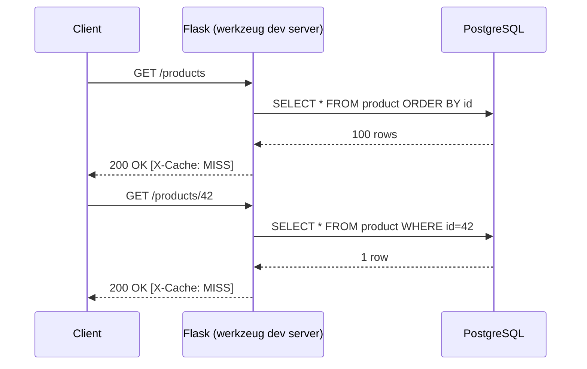
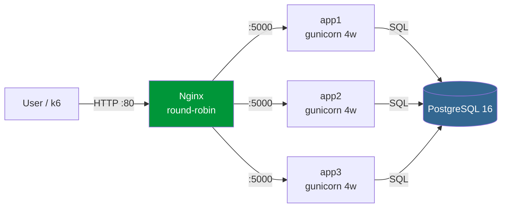
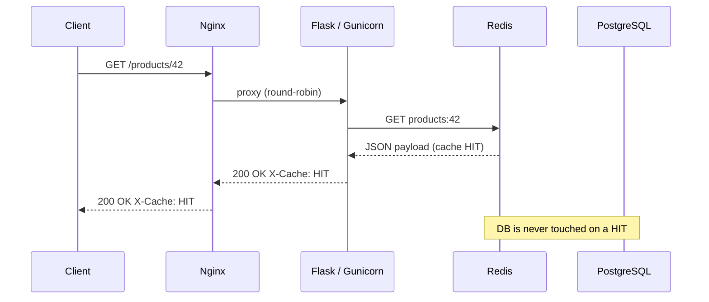
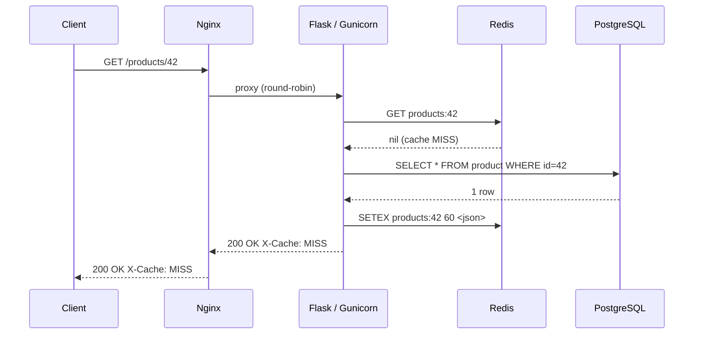
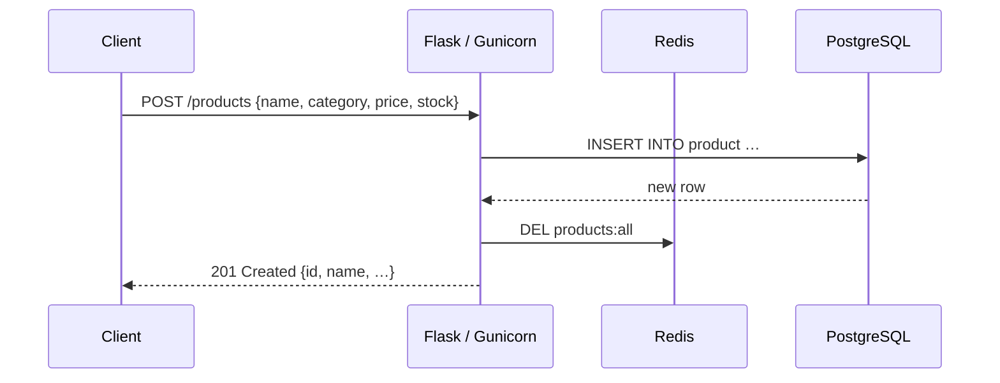
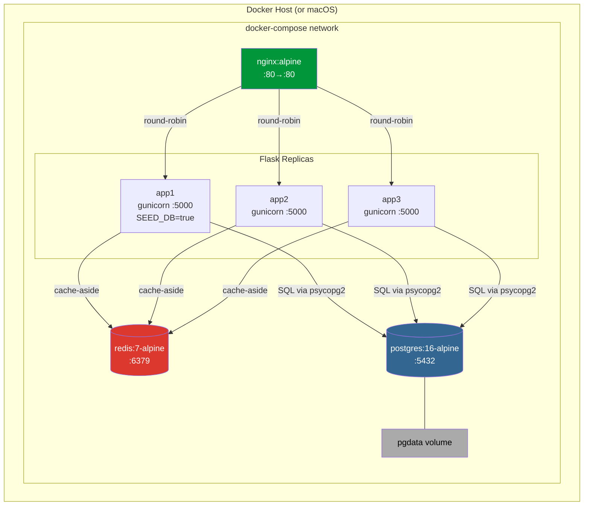
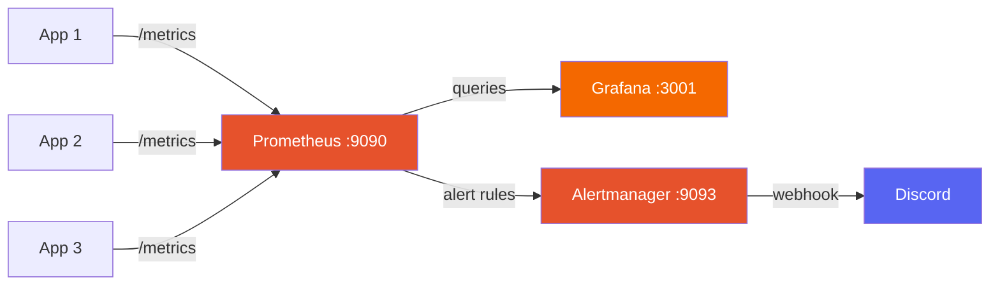

# Architecture

## Overview

The system is a horizontally-scaled Flask API behind Nginx, backed by PostgreSQL for persistence and Redis for read-through caching.

Three deployment modes are supported:

| Mode | Command | Use case |
|---|---|---|
| Local dev | `uv run run.py` | Single Flask process, no containers |
| Full stack | `docker compose up` | Nginx + 3 replicas + Postgres + Redis |
| Custom scale | `docker compose up --scale app1=N` | Adjust replica count |

---

## Bronze — Local Dev (no cache)

**Bottleneck:** Single-threaded werkzeug server; every request waits in line.

---

## Silver — Docker Compose (Nginx + 3 × Gunicorn, no cache)

**Capacity:** 4 workers × 3 instances = 12 concurrent request handlers.  
**Throughput observed:** ~163 RPS at 200 VUs.

---

## Gold — Full Stack with Redis Cache

### Request flow — cache HIT (steady state, ~98% of requests)

### Request flow — cache MISS (first request or TTL expired)

### POST (write-through invalidation)

---

## Component Map

---

## Key Design Decisions

| Component | Choice | Why |
|---|---|---|
| Load balancer | Nginx round-robin | Stateless replicas; no session affinity needed |
| App server | Gunicorn gevent workers | Async I/O handles ~200 concurrent connections per worker vs sync's 1 |
| Cache | Redis (shared) | All 3 replicas read the same key space; counters are atomic |
| Cache TTL | 60 seconds | Balance between freshness and hit rate; adjustable via `CACHE_TTL` in `app/cache.py` |
| DB persistence | pgdata named volume | Survives `docker compose down`; removed only with `down -v` |
| Seed ownership | app1 only (`SEED_DB=true`) | Prevents duplicate inserts on parallel startup |

| Monitoring | Prometheus + Grafana | Industry-standard observability stack; free, self-hosted |
| Alerting | Alertmanager + Discord | Fires alerts within 30s; routes to Discord for team notifications |
| Logging | Structured JSON (pythonjsonlogger) | Machine-parseable; includes timestamp, level, component, latency |
| Testing | pytest + pytest-cov (88%) | In-memory SQLite for fast tests; CI gate at 70% coverage |

See [docs/decision_log.md](decision_log.md) for the full rationale on each choice.

---

## Monitoring Stack

**Four Golden Signals tracked on the Grafana dashboard:**

| Signal | Metric | Panel |
|---|---|---|
| **Latency** | `http_request_duration_seconds` (p50/p95/p99) | Line chart |
| **Traffic** | `rate(http_requests_total[1m])` | Line chart |
| **Errors** | `http_errors_total / http_requests_total` | Line chart with thresholds |
| **Saturation** | `count(up{job="flask-app"} == 1)` | Stat panel (healthy instances) |
